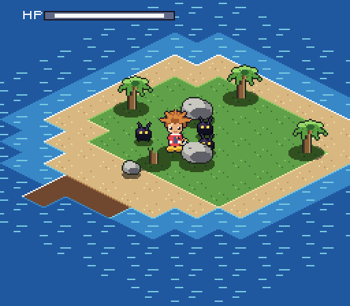

# Kingdom Hearts — SNES demake

An isometric 2.5D demake of Kingdom Hearts for the Super Nintendo. This builds
a real `.sfc` ROM that boots in any SNES emulator or on a flash cart — not a
SNES-styled game running on a modern engine.



Current state: a playable **Destiny Islands vertical slice**. Sora walks the
island in eight directions with correct depth sorting against palms and rocks,
translucent shadows, a camera that follows and clamps to the world, Shadow
Heartless that hunt him, and a Keyblade swing that knocks them back and kills
them.

## Build

Needs `cc65` (for `ca65`/`ld65`), Python 3 and Pillow.

```sh
sudo apt-get install cc65
pip install Pillow

make            # regenerate assets, assemble, link, fix the checksum
make assets     # regenerate art and map binaries only
make clean
```

The output is `kh.sfc` — 256 KiB, LoROM, FastROM, with a valid header and
internal checksum.

## Play

```sh
mednafen kh.sfc          # or snes9x, bsnes, Mesen-S, ...
make run                 # same thing
```

| Button | Action |
| --- | --- |
| D-pad | Move (eight directions) |
| B | Swing the Keyblade |

## Testing without a screen

`tools/playtest.sh` runs the ROM under a virtual X display, drives it with
scripted controller input, and writes PNG screenshots — so rendering and game
feel can be checked in CI or over SSH.

```sh
tools/playtest.sh kh.sfc shots/ "down:50" "up:100" "b:12"
```

Each step is `keys:frames`; keys are held for that many 60 Hz frames and a shot
is taken at the end. `none` just waits. Keys: `up down left right a b x y start
select`, combined with `+`.

For a headless capture with no X at all, mednafen can record raw video and
`tools/recframes.py` pulls individual frames out of it:

```sh
SDL_VIDEODRIVER=dummy mednafen -qtrecord rec.mov -qtrecord.vcodec raw kh.sfc
python3 tools/recframes.py rec.mov --frames 250 --out shots/
```

## How the isometric view works

The ground is a **background layer**, not sprites. That is possible because of
one number: the isometric diamonds are **32×16 pixels**. A 32×16 diamond
lattice steps 16 pixels horizontally and 8 vertically between tiles, and both
are multiples of 8 — so every diamond lands exactly on the PPU's 8×8 character
grid.

```
world_x = (i - j) * 16 + ORIGIN_X
world_y = (i + j) * 8
```

`tools/build_assets.py` paints the whole island into a 512×256 image, slices it
into 8×8 characters, and folds duplicates (matching against horizontal,
vertical and both flips, since the tilemap carries a flip bit per axis). The
entire island collapses to **56 unique characters**.

Everything that stands up off the ground — Sora, Heartless, palms, boulders —
is a sprite, and sprites draw strictly in OAM order. Sorting actors by world Y
descending and writing them out in that order makes Sora pass behind a palm
when he is north of it and in front when he is south, with no per-object layer
authoring at all.

Standing-on-tile queries invert the projection, and because both divisors are
powers of two it costs shifts instead of a divide:

```
a = world_x - ORIGIN_X
i = (a + 2 * world_y) >> 5
j = (2 * world_y - a) >> 5
```

## Hardware techniques used

- **Sprite streaming.** Sora is a 32×32 sprite with 30 animation cels. Keeping
  them all resident would cost 15 KiB of VRAM, so only the *current* cel lives
  in the sprite page; changing frames uploads 512 bytes during vblank as four
  128-byte rows (a 32×32 sprite occupies a 4×4 block of a 16-wide tile page).
- **Colour-math shadows.** Shadows are sprites on OBJ palette 4 drawn in black,
  with half-add colour math against BG1 on the sub screen. The result is the
  ground at 50% brightness — a real translucent shadow, not a dark blob.
- **Mode 1 with BG3 priority.** BG1 carries the ground, BG3 carries the HUD
  above everything, and sprites sit between them at priority 2.
- **FastROM** in banks `$80+`, LoROM mapping.

## Layout

```
src/
  main.s        reset, hardware bring-up, frame loop
  nmi.s         vblank: OAM, scroll, sprite streaming, HUD upload
  iso.s         isometric projection, camera, ground collision
  oam.s         depth sort and sprite table construction
  world.s       actors, Sora, Heartless, combat
  hud.s         HP gauge on BG3
  pad.s         controller input
  ram.s         storage; game.inc / ram.inc / snes.inc  declarations
  header.s      cartridge header and vectors
tools/
  build_assets.py   all art and map data (original pixel art, drawn in code)
  pixel.py          canvas, palettes, SNES tile/palette encoders
  fixrom.py         internal checksum
  playtest.sh       scripted input + screenshots
  recframes.py      frame extraction from a mednafen recording
assets/
  island.txt        the play space, editable as plain text
  src/              indexed PNG previews (editable, re-importable)
```

## ROM budget

| Segment | Bank | Size |
| --- | --- | --- |
| CODE + RODATA | `$80` | 3.6 KiB |
| BG graphics + HUD font | `$81` | 3.8 KiB |
| Sprite page | `$82` | 8 KiB |
| Tilemap, collision, palettes | `$83` | 4.8 KiB |
| Sora animation sheet | `$84` | 15 KiB |

VRAM is fully mapped: BG1 characters at `$0000`, HUD font at `$1000`, ground
tilemap at `$1400`, HUD tilemap at `$1C00`, sprite page at `$4000`.

## Editing the island

`assets/island.txt` is a 16×16 grid of terrain codes; `make` recompiles the
tilemap, the collision map and the tileset from it.

```
~  deep water     -  shallow water   .  sand      ,  grass    =  wood dock
#  cliff rock     T  palm (blocked)  R  boulder   r  rock
```

Actor spawns live in `spawnTable` at the bottom of `src/world.s`, in isometric
tile coordinates.

## Roadmap

The slice is deliberately bounded by one constraint: a 64×32 tilemap is 512×256
pixels, which is exactly one screen of isometric ground, so the world currently
fits in VRAM with no streaming. In rough order:

1. **Tilemap streaming** — upload columns and rows as the camera crosses tile
   boundaries, which lifts the world-size ceiling entirely.
2. **Combat depth** — three-hit ground combo, lock-on targeting, MP and a magic
   slot, Heartless that telegraph and dodge.
3. **Party members** — Donald and Goofy as followers with their own AI.
4. **More worlds** — the map format and asset pipeline are already per-world;
   Traverse Town is the natural second.
5. **Audio** — SPC700 driver, which is a self-contained project of its own.

## A note on the art

Every asset here is original, generated by `tools/build_assets.py`: nothing is
traced, ripped, or imported from a commercial release. The palettes and
proportions were written from scratch to fit SNES limits (16 colours per
palette, 4bpp tiles, 256-tile pages). The art is drawn in code so it can be
regenerated and tuned, and each piece is also exported as an indexed PNG under
`assets/src/` — replace one of those with your own and it flows straight
through the pipeline.

This is a fan project, not affiliated with or endorsed by Square Enix or
Disney. Kingdom Hearts and its characters are their property. Worth being
clear-eyed about the legal position: copyright infringement does not require
making money, so "non-commercial" is not by itself a defence — what actually
keeps a project like this out of trouble is not distributing it.
