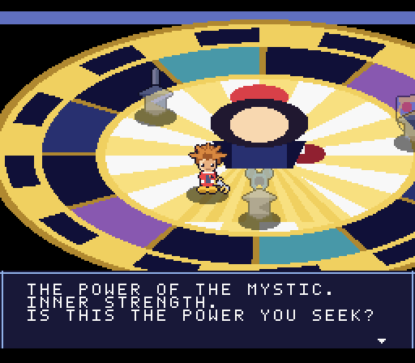
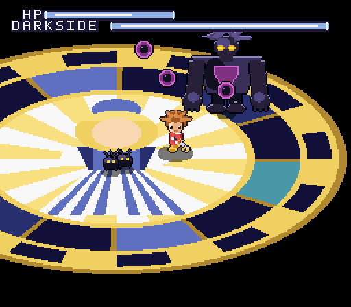
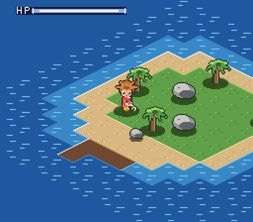
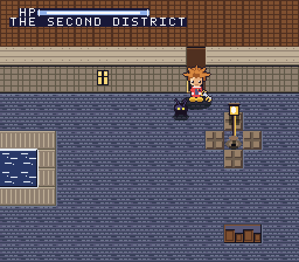
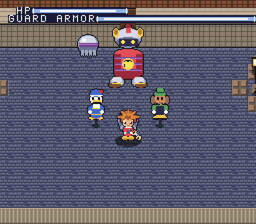

# Kingdom Hearts — a demake

A demake of Kingdom Hearts for real hardware — not a retro-styled game on a
modern engine. Two targets share one set of content:

| | |
| --- | --- |
| **`platform/snes/`** | **Complete and frozen at `b8f2b68`.** A real `.sfc` ROM: LoROM, FastROM, valid header and checksum. Top-down three-quarter view, the A Link to the Past / Secret of Mana angle |
| **`platform/ds/`** | **In preparation.** The DS has hardware 3D, so the camera the source material actually uses is reachable — which is what forced the SNES version onto a locked view. See `platform/ds/README.md` |

The map data, the dialogue, the asset pipeline and every tuning number are shared
between them. `docs/BEHAVIOUR.md` is the specification the SNES build was
reverse-documented into, and it is the authority for both.

The freeze point is commit `b8f2b686a68470fb650c6edbe41c4d1cb63c899e`, tagged `snes-final` locally.

The SNES build is kept, and not for sentiment: both platforms run at 60 Hz, every
timing is in frames and the spawn tables are identical, so it is a behavioural
oracle for the port. Drive both with the same input, diff the state traces, and a
divergence is a bug.

## What is playable (SNES)

Everything below runs end to end today.



The game opens where it should: the **Dive to the Heart**. Sora stands on a
stained-glass platform, a voice speaks, and three pedestals offer the Dream
Sword, Shield and Rod. Walking up to one describes its power and asks whether
you want it. Take one, give one up, and the platform breaks apart underfoot.



He lands on a second station where the first Shadows are waiting. Clear them
and his own shadow rises into **Darkside**. It alternates two attacks: a fist
that telegraphs, marks the ground where Sora is standing and lands there a beat
later leaving a new Shadow in the crater, a volley of three dark orbs spat
from the hole in its chest, and — if you stand underneath it — a short-notice
arm sweep across the ground at its feet. The first two are dodged by moving;
the third is the punish for not moving at all.

Run out of HP and the screen dims, a GAME OVER line comes up, and the fight
restarts from the boss rather than from the Shadows.



Beat it and the light takes him: the screen washes to white, and he wakes on
the beach at **Destiny Islands**.

Two days of the island opening are playable. Kairi asks for the raft materials
and checks them off on the HUD; the day turns over and asks for provisions;
Riku races him round the island for the right to name the raft. Behind the
waterfall is the Secret Place, with the chalk drawings and the door that has no
handle.

Then the storm comes. The island at night is **the same tileset, the same
tilemap and the same collision map with one palette uploaded over the top** —
lightning, Shadow Heartless arriving out of the dark, a wooden sword that goes
straight through them, and Riku out past the bridge with his hand held out. The
Keyblade arrives too late for Kairi. The island tears apart, and what is left of
it is one scrap of ground with Darkside standing on it. See
`docs/DESTINY_ISLANDS.md`.



Beat that and the islands are gone, and he washes up face down on wet stone in
**Traverse Town** — three districts of one screen each, joined by doors. The
First District has a shop row with one light still on and somebody behind it who
will tell you which way to go. The Second has the fountain, and the Heartless,
and a door on the far side that will not open while the square behind you is
still moving.



The Third District is where the roof comes down. Two people fall out of the sky
and land in the square, and then so does the **Guard Armor** — a suit of armour
with nobody in it that holds station at the head of the square, follows you left
and right, and drops a fist where you are standing. It is 64× 64 like Darkside,
and its two hands are separate actors so the depth sort draws them in front of
its own torso. See `docs/TRAVERSE_TOWN.md`.

## Build

Needs `cc65` (for `ca65`/`ld65`), Python 3 and Pillow.

```sh
sudo apt-get install cc65
pip install Pillow

make -C platform/snes            # check, assets, assemble, link, fix checksum
make -C platform/snes check      # the static checks on their own
make -C platform/snes assets     # regenerate art and map binaries only
make -C platform/snes clean
```

The tools live at the repository root and are shared, so they can also be run
directly: `python3 tools/check_map.py` flood-fills every map for both targets.

The output is `kh.sfc` — 512 KiB, LoROM, FastROM, with a valid header and
internal checksum.

## Play

```sh
mednafen platform/snes/kh.sfc     # or snes9x, bsnes, Mesen-S, ...
make -C platform/snes run         # same thing
```

| Button | Action |
| --- | --- |
| D-pad | Move (eight directions); pick an option in a prompt |
| A | Talk / examine a pedestal; advance and confirm dialogue |
| B | Swing the Keyblade; also advances dialogue |

## Testing without a screen

`tools/playtest.sh` runs the ROM under a virtual X display, drives it with
scripted controller input, and writes PNG screenshots — so rendering and game
feel can be checked in CI or over SSH.

```sh
tools/playtest.sh kh.sfc shots/ "down:50" "up:100" "b:12"
```

Each step is `keys:frames`; keys are held for that many 60 Hz frames and a shot
is taken at the end. `none` just waits. Keys: `up down left right a b x y start
select`, combined with `+`.

For a headless capture with no X at all, mednafen can record raw video and
`tools/recframes.py` pulls individual frames out of it:

```sh
SDL_VIDEODRIVER=dummy mednafen -qtrecord rec.mov -qtrecord.vcodec raw kh.sfc
python3 tools/recframes.py rec.mov --frames 250 --out shots/
```

## How the view works

Seen from three-quarters overhead, screen space *is* world space. The ground is
a square lattice of **16×16 tiles**, so a 32×16 grid spans 512×256 pixels —
exactly one 64×32 PPU tilemap — and the ground can be a **background layer**
rather than sprites:

```
world_x = i * 16      world_y = j * 16
```

Which means a standing-on-tile query, the thing the engine asks constantly, is
not a projection at all. It is two shifts:

```
i = world_x >> 4      j = world_y >> 4
```

Both shifts turn a negative coordinate into a large unsigned one, so the range
check that follows rejects "off the west edge" and "off the east edge" in the
same compare.

`tools/build_assets.py` paints the whole island into a 512×256 image, slices it
into 8×8 characters, and folds duplicates (matching against horizontal,
vertical and both flips, since the tilemap carries a flip bit per axis). The
island collapses to **244 unique characters** of the 512 BG1 holds.

Everything that stands up off the ground — Sora, Heartless, palms, boulders —
is a sprite, and sprites draw strictly in OAM order: slot 0 is frontmost. From
this angle, further down the screen means nearer, so sorting actors by world Y
descending and writing them out in that order makes Sora pass behind a palm
when he is north of it and in front when he is south, with no per-object layer
authoring at all.

### Height

`assets/island.txt` gives every terrain code a height in eight-pixel steps, and
three things use it:

- **Painting.** A tile at *h* steps is drawn `8h` pixels above its cell with a
  cliff face filling the gap back down — which is what makes a ledge read as a
  ledge, and means the tile covers `8h` pixels of whatever is north of it. The
  map is authored around that: the cell above a raised structure is always
  water, rock, or more of the same structure.
- **Walking.** A move is refused unless the destination is within one step of
  where the actor stands, so a deck at +2 is sealed off except across its +1
  step tile. That is what turns a plank into a ladder.
- **Drawing actors.** Each actor caches the height it stepped onto in `actZ`;
  the sprite and its shadow are lifted by `8 * actZ`. Geometry and the depth
  sort still see one flat plane.

## Hardware techniques used

- **Sprite streaming.** Sora is a 32×32 sprite with 30 animation cels. Keeping
  them all resident would cost 15 KiB of VRAM, so only the *current* cel lives
  in the sprite page; changing frames uploads 512 bytes during vblank as four
  128-byte rows (a 32×32 sprite occupies a 4×4 block of a 16-wide tile page).
- **Colour-math shadows.** Shadows are sprites on OBJ palette 4 drawn in black,
  with half-add colour math against BG1 on the sub screen. The result is the
  ground at 50% brightness — a real translucent shadow, not a dark blob.
- **Mode 1 with BG3 priority.** BG1 carries the ground, BG3 carries the HUD
  and dialogue above everything, and sprites sit between them at priority 2.
- **Two transitions, both from registers.** The platform shattering is MOSAIC
  coarsening BG1 while brightness falls; the ending is colour math adding a
  fixed colour to every layer, ramped to white. Note the whiteout only takes
  the backgrounds: the SNES restricts OBJ colour math to palettes 4-7, so
  sprites ride through it unwashed.
- **A shatter built from registers, not art.** The platform coming apart is
  MOSAIC coarsening BG1 into ever larger blocks while brightness falls and the
  screen shakes — no debris tileset needed.
- **A boss larger than a sprite.** The SNES caps a sprite at 64×64, and taking
  that size slot would cost the 16×16 one the Shadows need. Darkside is
  therefore four 32×32 sprites emitted as a block, after every sorted actor so
  it always lands behind them — correct nearly always, since Sora fights at
  its feet.
- **A night for one palette.** The island after dark reuses every byte of the
  daytime tileset, tilemap, collision map and height map; what changes is 32
  bytes of BG palette and 64 of OBJ. The Shadows are the awkward part, because
  OBJ palette 1 already belongs to the islanders — so they are drawn a second
  time against the three colours the islanders who went home were using.
- **Colour math shadowed in RAM.** `CGWSEL`/`CGADSUB` are written by the NMI
  from two RAM bytes, so lightning can flip the unit between translucent
  shadows and add-white in vblank instead of tearing a seam mid-frame.
- **Register widths, checked at build time.** On the 65816 `LDA #` is two bytes
  with an eight-bit accumulator and three with a sixteen-bit one, and the
  assembler only knows which from the `.a8` / `.a16` directives it was given.
  Those directives are sequential and control flow is not, so a `.a16` stretch
  that ends in a `jmp` leaves everything after it assembled sixteen-bit — and
  the spare byte the assembler emits is a `BRK` the CPU walks into, after which
  every following byte is a misaligned instruction and the damage lands wherever
  those bytes happen to address. That is six debugging sessions on this project,
  the last of them a black screen in the Second District.
  `tools/check_modes.py` therefore does not guess: for each `.proc` it walks the
  control-flow graph from the entry — fall-through, branch and jump edges —
  carrying the widths the CPU actually has, which only `rep` and `sep` change,
  and fails the build on any reachable immediate whose assembled size disagrees.
  Two earlier versions compared a branch against its target instead; that finds
  a disagreement between the two, which is not the same thing, and it is exactly
  what let the last one through — the branch and its target agreed with each
  other and were both wrong.
- **A world for four binaries a room.** Traverse Town's three districts are the
  same 32×16 grid the island is, so a district is characters, tilemap, collision
  and height and nothing else — and the doors between them are a seven-byte
  table row, not three special cases. Which stage the town has to have reached
  for a given door to open is in the same row, so the place is gated without a
  lock flag anywhere.
- **FastROM** in banks `$80+`, LoROM mapping.

## Layout

```
platform/snes/
  src/
    main.s      reset, hardware bring-up, frame loop, scene loading
  nmi.s         vblank: OAM, scroll, sprite streaming, HUD and text upload
  grid.s        tile geometry, camera, ground collision
  oam.s         depth sort and sprite table construction
  world.s       actors, Sora, Heartless, combat
  dive.s        Station of Awakening: script, pedestals, weapon choice
  island.s      Destiny Islands: the two days, the race, the Secret Place
  night.s       the night it falls, and the last piece of it
  town.s        Traverse Town: three districts, the doors, the Guard Armor
  text.s        dialogue window, typewriter reveal, yes/no prompts
  hud.s         HP gauge on BG3
  pad.s         controller input
  ram.s         storage; game.inc / ram.inc / snes.inc  declarations
  header.s      cartridge header and vectors
tools/
  build_assets.py   all art and map data (original pixel art, drawn in code)
  pixel.py          canvas, palettes, SNES tile/palette encoders
  fixrom.py         internal checksum
  check_map.py      flood-fills every map against every spawn point
  check_modes.py    finds immediates assembled at the wrong register width
  playtest.sh       scripted input + screenshots
  recframes.py      frame extraction from a mednafen recording
assets/
  island.txt        the play space, editable as plain text
  fragment.txt      what is left of it after the island comes apart
  town1.txt         Traverse Town, First District
  town2.txt         ...Second, with the fountain
  town3.txt         ...Third, where it comes down on them
  src/              indexed PNG previews (editable, re-importable)
docs/
  DESTINY_ISLANDS.md   what the two days and the night contain
  TRAVERSE_TOWN.md     the three districts, the doors, the Guard Armor
```

## ROM budget

| Segment | Bank | Size |
| --- | --- | --- |
| CODE + RODATA | `$80` | 20.4 KiB |
| Island BG graphics + HUD font | `$81` | 9.6 KiB |
| Sprite pages (three cuts of one VRAM page) | `$82` | 24 KiB |
| Tilemaps, collision, height, palettes | `$83` | 6.7 KiB |
| Sora animation sheet | `$84` | 15 KiB |
| Stations of Awakening | `$85`-`$87` | 3 × ~12.5 KiB |
| The last piece of the island | `$88` | 8.5 KiB |
| Traverse Town, districts one and two | `$89` | 14.7 KiB |
| ...and three | `$8A` | 7 KiB |

Five banks of the sixteen are still empty, and `kh.cfg` names them, so the next
world is a segment and an `.incbin` rather than a relink of everything.

VRAM is fully mapped: BG1 characters at `$0000` (512 tiles -- the stained glass
needs 258 of them where the island's terrain folds to 244), the 2bpp font at
`$2000`, the ground tilemap at `$2400`, the BG3 tilemap at `$2C00`, and the two
sprite pages at `$4000` and `$5000`.

## Scenes and dialogue

`LoadScene` swaps BG characters, tilemap, palette and collision map during
forced blank, so a scene is just a set of four binaries plus a script. The
collision map is reached through a long pointer, which is why the walkability
test does not care which scene it is in.

Dialogue scripts are plain bytes in ROM: anything from 32 up is a character,
below that are control codes (`SC_NL` newline, `SC_PAGE` wait-and-clear,
`SC_END`). A message can be opened as a plain box or as a yes/no prompt whose
answer lands in `txtResult`. Writing a new scene is mostly writing a table of
spawns and a few strings -- see `src/dive.s`.

## Editing the island

`assets/island.txt` is a 32×16 grid of terrain codes -- what you read is what
you see -- and `make` recompiles the tilemap, the collision map, the height map
and the tileset from it.

```
~  deep water     -  shallow water   .  sand      ,  grass     =  wood dock
W  waterfall pool C  cave floor      b  bush      T  palm      Y  nut palm
R  boulder        r  rock            #  cliff     F  cliff with the waterfall
B  bridge +1      L  step +1         P  deck +2   H  treehouse +2
M  trunk +2       K  treetop +3       *  the dark (fragment.txt only)
```

Traverse Town's three districts are the same format, in `assets/town1.txt`,
`town2.txt` and `town3.txt`, with their own vocabulary:

```
c  cobbles        p  paving under a lamp   s  step +1     q  raised walkway +2
w  building +3    e  ...with a lit window  o  roof +3     d  a doorway
x  crates         l  a lamp post           n  parapet     v  fountain water
```

A doorway has to sit in the bottom row of a building block with open ground to
the south -- that is the only row of one that shows a face, so it is the only row
a door can be painted into.

Actor spawns live in `spawnTable` at the bottom of `src/world.s`, in
`day1Spawns` / `day2Spawns` in `src/island.s`, and in `town1Spawns` and friends
in `src/town.s`, all in tile coordinates. `tools/check_map.py` flood-fills every
map with the engine's own one-step rule and fails if any spawn, or either side of
any door, has become unreachable -- which is cheaper than finding out by
playing.

## Roadmap

The slice is bounded by one constraint: a 64×32 tilemap is 512×256 pixels, so
the whole world fits in VRAM with no streaming. In rough order:

1. **Traverse Town interiors** — the districts are in; the shops, the accessory
   counter and an inventory that survives a scene change are not. The door table
   already takes them: a room is a text map and three lines of data.
2. **Tilemap streaming** — upload columns and rows as the camera crosses tile
   boundaries, which lifts the world-size ceiling entirely and is what a world
   bigger than one screen a room would need.
3. **Dive polish** — Sora's death is a dim and a retry; a proper collapse and a
   CONTINUE / QUIT choice would sell it better.
4. **Combat depth** — three-hit ground combo, lock-on targeting, MP and a magic
   slot, Heartless that telegraph and dodge.
5. **Audio** — SPC700 driver, which is a self-contained project of its own.

## A note on the art

Every asset here is original, generated by `tools/build_assets.py`: nothing is
traced, ripped, or imported from a commercial release. The palettes and
proportions were written from scratch to fit SNES limits (16 colours per
palette, 4bpp tiles, 256-tile pages). The art is drawn in code so it can be
regenerated and tuned, and each piece is also exported as an indexed PNG under
`assets/src/` — replace one of those with your own and it flows straight
through the pipeline.

This is a fan project, not affiliated with or endorsed by Square Enix or
Disney. Kingdom Hearts and its characters are their property. Worth being
clear-eyed about the legal position: copyright infringement does not require
making money, so "non-commercial" is not by itself a defence — what actually
keeps a project like this out of trouble is not distributing it.
